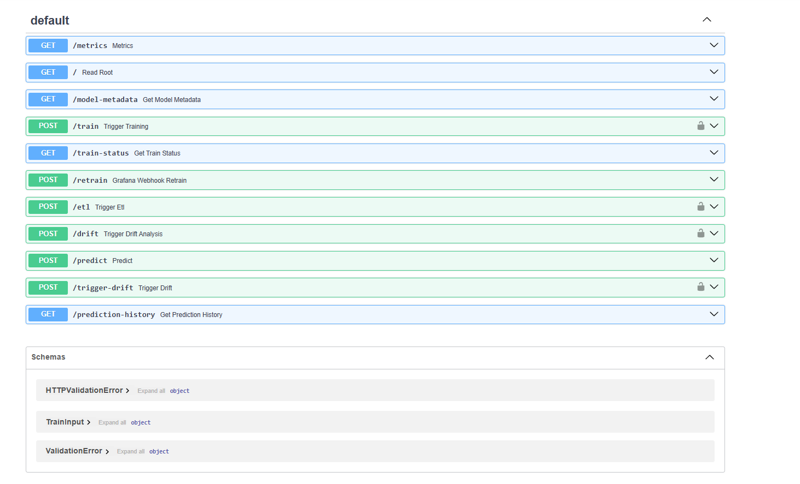
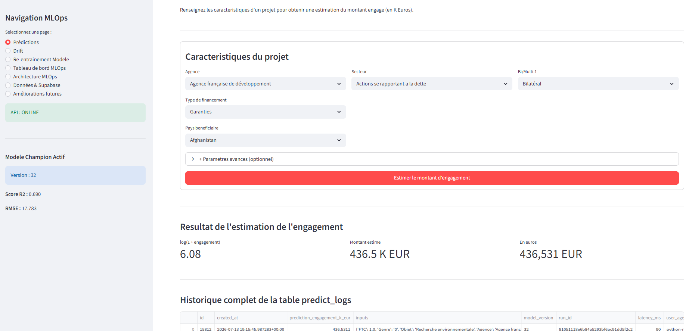
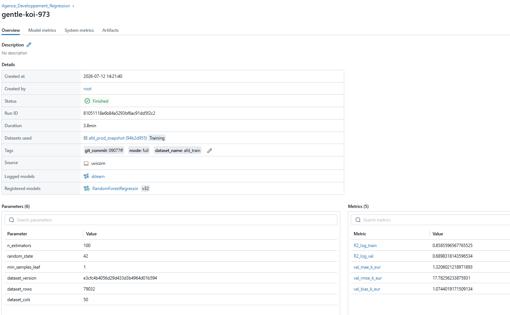
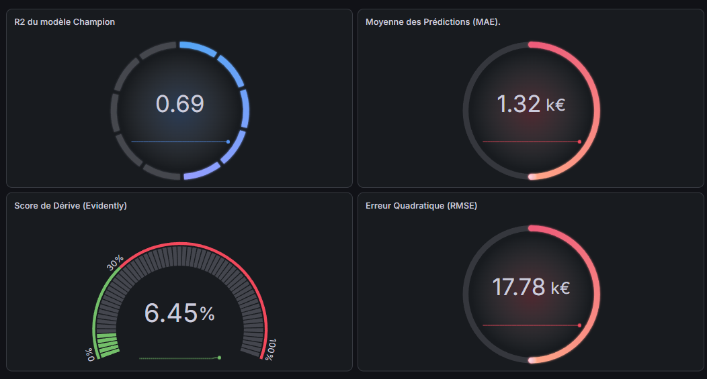
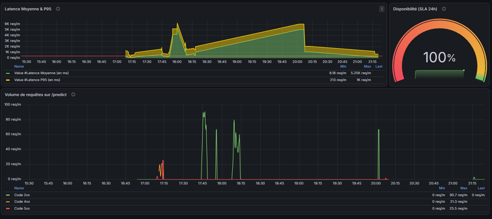
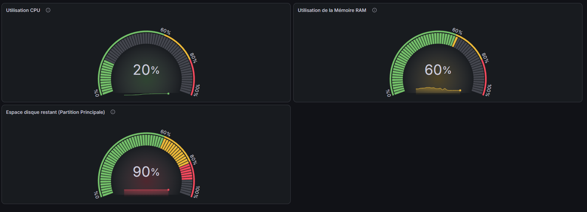
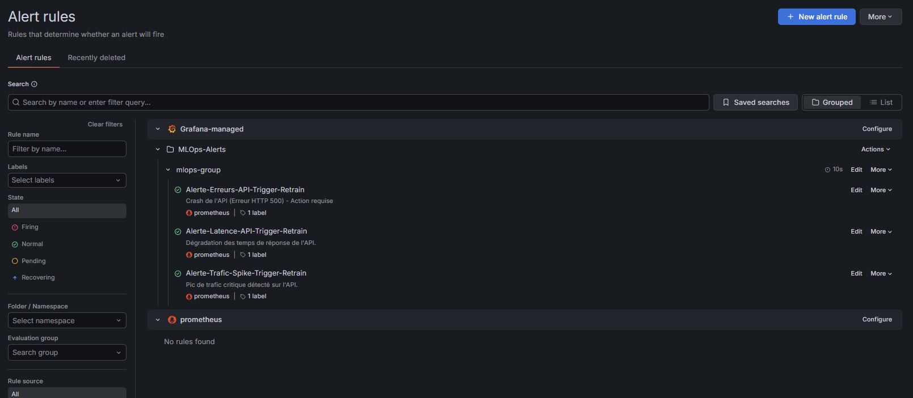
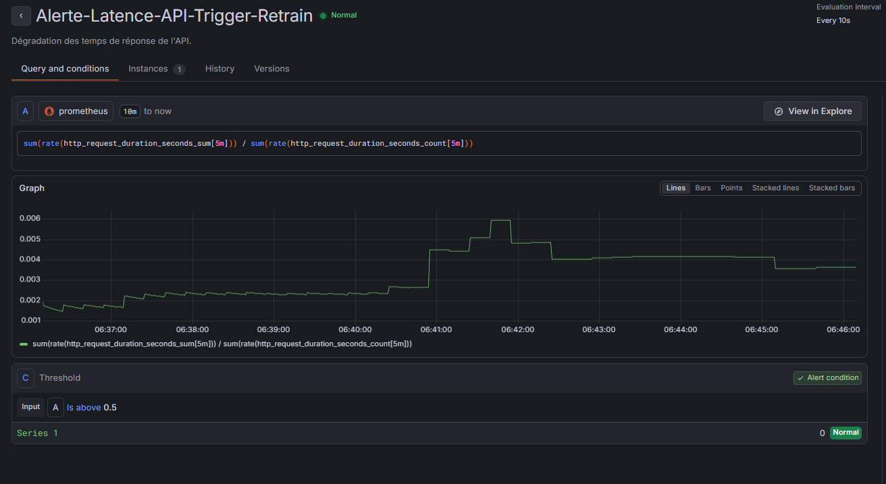

# 📊 Projet APD – Plateforme MLOps de prédiction de l'Aide Publique au Développement

## 📖 Présentation

Ce projet a été réalisé dans le cadre d'une étude MLOps visant à prédire les **engagements de l'Aide Publique au Développement (APD)** à partir de données ouvertes.

L'objectif est de mettre en place une chaîne MLOps complète allant de l'entraînement du modèle jusqu'à son déploiement en production.

Le projet intègre :

- 📊 Prétraitement des données
- 🤖 Machine Learning (Random Forest Regressor)
- 📈 MLflow Tracking & Model Registry
- 🗄️ Supabase PostgreSQL pour le backend MLflow
- 🚀 API REST FastAPI
- 🌐 Interface utilisateur Streamlit
- 🐳 Docker
- ⚙️ GitHub Actions (CI/CD)
- 📊 Monitoring Système et Métier (Prometheus, Grafana, Evidently)

---

# 🏗️ Architecture MLOps

```text
                  Utilisateur
                       │
                       ▼
                🌐 Streamlit
                       │
                       ▼
                 🚀 FastAPI API
                       │
                       ▼
        MLflow Model Registry (Champion)
                       │
                       ▼
             Random Forest Regressor
                       │
                       ▼
         Supabase PostgreSQL (Tracking)
```

---

# 📂 Structure du projet

```text
Agence_Dvpt/

├── api/
├── app/
├── data/
├── docs/
├── etl/
├── grafana/
│   └── dashboards/
│   └── alerting/
├── grafana/dashboards
├── ingestion/
├── models/
├── notebooks/
├── preprocessing/
├── scripts/
├── tests/
├── .github/
│   └── workflows/
├── Dockerfile
├── requirements.txt
└── README.md
```

---

# 🚀 Fonctionnalités

## Prétraitement

- Nettoyage des données APD
- Préparation des variables
- Construction du dataset final

---

## Machine Learning

Le modèle utilisé est un :

**Random Forest Regressor**

Objectif : Prédire les **Engagements (K EUR)**.

---

## MLflow

Le projet utilise MLflow pour :

- suivre les expériences
- enregistrer les paramètres et les métriques
- sauvegarder les artefacts
- gérer les versions des modèles
- promouvoir automatiquement le modèle **Champion**

---

## Supabase

Le backend MLflow est connecté à une base PostgreSQL hébergée sur Supabase afin de conserver :

- les runs
- les paramètres
- les métriques
- les versions des modèles

---

## 🧭 Architecture de l'API (Endpoints)

L'API est le cœur du système MLOps. Elle fait le pont entre la base de données (Supabase), le registre de modèles (MLflow) et le système d'alerte (Prometheus/Grafana).

### 🟢 Inférence & Prédictions
- **`POST /predict`** : Route principale. Reçoit les caractéristiques d'un projet et retourne le montant de l'engagement prédit par le modèle "Champion".
- **`GET /prediction-history`** : Récupère l'historique des prédictions passées (utile pour l'audit et l'analyse de dérive).

### ⚙️ Pipeline MLOps & Entraînement
- **`GET /model-metadata`** : Interroge MLflow pour récupérer la version, le R² et l'identifiant du modèle actuellement en production.
- **`POST /train`** : Déclenche manuellement le pipeline complet d'entraînement d'un nouveau modèle.
- **`GET /train-status`** : Vérifie l'état (en cours, terminé, échec) de la tâche d'entraînement lancée en arrière-plan.
- **`POST /retrain`** : *Webhook sécurisé*. Écoute les alertes automatiques de Grafana pour déclencher un ré-entraînement d'urgence sans intervention humaine (Closed-loop MLOps).

### 📊 Data & Analyse de Dérive (Drift)
- **`POST /etl`** : Déclenche le pipeline d'Extraction, Transformation et Chargement (ETL) depuis Supabase.
- **`POST /drift`** : Lance l'analyse Evidently pour comparer les nouvelles données en production avec les données d'entraînement et calculer le score de dérive.
- **`POST /trigger-drift`** : *[Route de Test]* Injecte artificiellement de mauvaises métriques pour simuler une dérive et tester le déclenchement des alertes Grafana.

### 🛠️ Supervision Système
- **`GET /health`** : Point d'entrée de l'API (Health Check basique).
- **`GET /metrics`** : Expose les métriques internes de l'API et du modèle (Latence, Requêtes, Erreurs, R², Drift) au format Prometheus pour le scraping.

---

# 🌐 Interface Streamlit

L'application Streamlit permet :

- de saisir les caractéristiques d'un projet APD
- d'envoyer les données à l'API
- d'afficher la prédiction
- d'afficher le modèle Champion utilisé
- d'afficher les métriques du modèle
- de consulter l'historique des prédictions

---

# 📈 Résultats du modèle Champion

| Indicateur | Valeur |
|------------|--------|
| Modèle | Random Forest |
| Version MLflow | v32 |
| Statut | Champion |
| R² | 0.689 |
| MAE | 1.320 K EUR |

---

# ⚙️ Installation

### 📥 1. Cloner le dépôt
Commencez par cloner le dépôt sur votre machine locale et placez-vous dans le répertoire du projet :

```bash
git clone https://github.com/MohamedAfiri75011/AFD.git
cd AFD
```

### 🐍 2. Création, activation et installation des dépendances
Selon votre système d'exploitation, exécutez les commandes suivantes à la racine du projet :

**Sous Windows (PowerShell) :**
```powershell
# 1. Création de l'environnement virtuel
python -m venv agence

# 2. Activation
.\agence\Scripts\Activate.ps1

# 3. Installation des paquets requis
pip install -r requirements.txt
```

**Sous Linux / macOS :**
```bash
# 1. Création de l'environnement virtuel
python3 -m venv agence

# 2. Activation
source agence/bin/activate

# 3. Installation des paquets requis
pip install -r requirements.txt
```

---

# ▶️ Lancer l'API

```bash
uvicorn api.main:app --reload
```
**Documentation Swagger (Health Check & Tests) :** 👉 <http://localhost:8000/docs>

---

# ▶️ Lancer Streamlit

```bash
streamlit run app/app.py
```

---

# ▶️ Lancer MLflow

> ⚠️ **Note :** Assurez-vous d'avoir configuré la variable `$MLFLOW_TRACKING_URI` dans votre environnement (ou via un fichier `.env`) avant de lancer cette commande.

```bash
mlflow ui \
--backend-store-uri $MLFLOW_TRACKING_URI \
--host 127.0.0.1 \
--port 5001 \
--allowed-hosts "*"
```

---

# 🔄 Intégration Continue

Le projet utilise **GitHub Actions**.

À chaque `git push` sur la branche **main**, le workflow CI :

- installe les dépendances
- vérifie le projet
- valide le pipeline CI/CD

---

# 📊 Monitoring & Remédiation automatique

Le projet intègre un système de monitoring complet (Grafana/Prometheus) couplé à Evidently AI pour détecter la dérive des données (Data Drift) et la santé du système.

### Fonctionnalités

- Génération automatique de rapports HTML et JSON avec Evidently.
- Intégration du rapport de dérive dans l'interface Streamlit.
- Boucle de remédiation automatique (Closed-loop MLOps) déclenchée par des Webhooks Grafana en cas de plantage (Erreur HTTP 500).
- Script `models/compute_drift.py` analysant la dérive avec un mode simulation (par défaut) pour éviter tout réentraînement involontaire.
- Lancement de l'analyse et du réentraînement manuel disponible avec la commande :

```bash
python models/compute_drift.py --execute
```

---

# 🔮 Perspectives d'amélioration

- Orchestration des pipelines avec Airflow
- Déploiement Cloud complet (AWS/GCP/Azure)
- Conteneurisation avancée avec Kubernetes
- Authentification renforcée sur l'API
- Couverture de tests unitaires et d'intégration (CI/CD)

---

# 📚 Technologies utilisées
   
- **Data & Modélisation :** Python, Pandas, NumPy, Scikit-Learn
- **Backend & Frontend :** FastAPI, Streamlit
- **MLOps & BDD :** MLflow, Supabase (PostgreSQL)
- **Monitoring :** Prometheus, Grafana, Evidently AI
- **DevOps :** Docker, Git, GitHub Actions
   
---

# 👥 Auteurs

Projet réalisé par :

- **Augustin FAYE**
- **Mohamed AFIRI**

---

# 📸 Aperçu de la plateforme

## 🌐 API FastAPI
L'API REST permet d'entraîner le modèle, d'effectuer des prédictions, de consulter les métriques et d'accéder à l'historique des prédictions via une documentation Swagger interactive.


## 💻 Interface Streamlit
L'application Streamlit constitue l'interface utilisateur du projet. Elle permet d'envoyer des données à l'API, d'obtenir une prédiction et d'afficher les informations du modèle Champion.


## 📈 MLflow (Model Registry)
MLflow assure le suivi des expériences d'entraînement, l'enregistrement des métriques et le versionnement. Le modèle Champion est automatiquement utilisé par l'API.


---

# 📈 Supervision & Alerting avec Grafana

Grafana, alimenté par les métriques collectées en temps réel par Prometheus, centralise la supervision technique et métier de toute notre architecture MLOps.

## 🧠 Tableaux de bord de Performance IA
Ce panneau suit la précision de notre modèle Random Forest. Il affiche en continu le coefficient de détermination (R²), l'impact métier concret via l'Erreur Absolue Moyenne (**MAE** en k€), l'impact des valeurs aberrantes (**RMSE**), ainsi que le score de dérive des données (Calculé via Evidently).


## ⚡ Performance Opérationnelle & Disponibilité API
Ce tableau de bord surveille la santé de notre microservice FastAPI. Il permet de suivre la latence (P95) des requêtes de prédiction, le volume de trafic ainsi que la répartition des codes de retour HTTP (Succès 2xx, Erreurs clients 4xx, Crashs serveur 5xx) pour garantir un taux de disponibilité (**SLA**) de 100 %.


## 🖥️ Monitoring Système (Infrastructure)
Pour s'assurer que notre modèle ne sature pas la machine hôte, ce panneau supervise la consommation des ressources matérielles sous-jacentes : le taux d'utilisation du CPU, la charge de la mémoire RAM et le stockage disponible sur le disque principal.


## ⚡ Alertes
Alerte Erreur Serveur : Se déclenche immédiatement pour vous prévenir si l'API rencontre un problème technique ou un plantage (Erreurs 500).

Alerte Pic de Trafic : Détecte une augmentation soudaine et anormale du nombre de requêtes envoyées à l'application.

Alerte Dérive des Données : Vous prévient quand les nouvelles données changent trop par rapport au passé, indiquant qu'il faut ré-entraîner le modèle.



